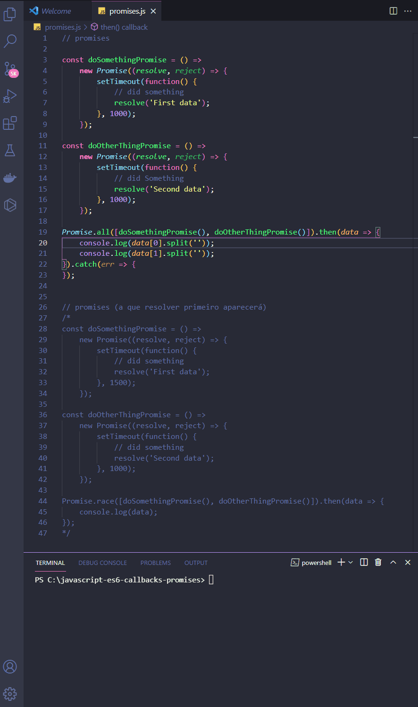
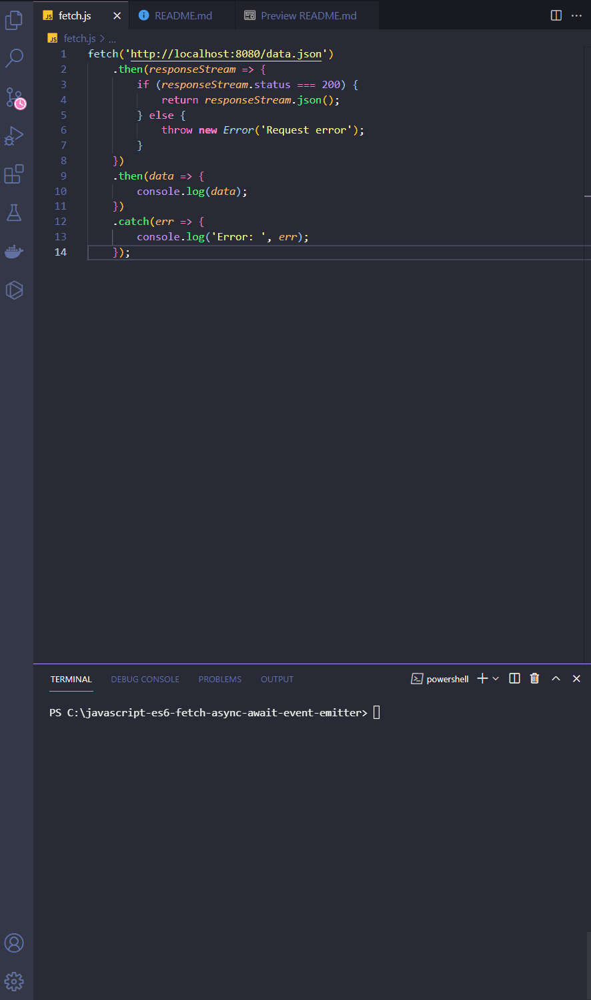
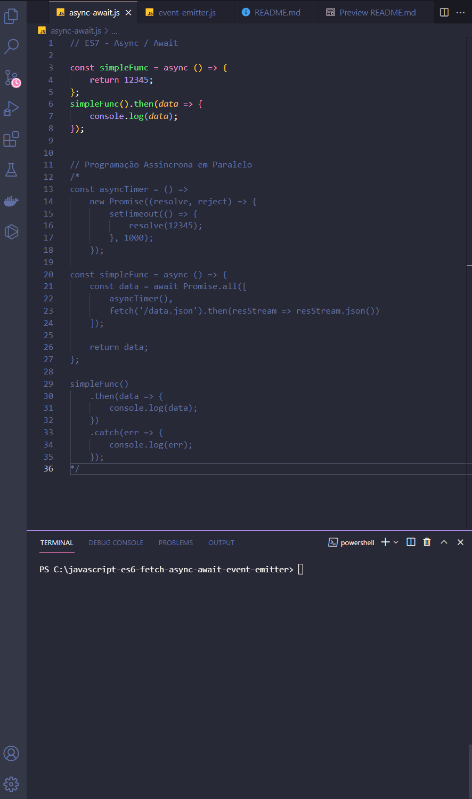
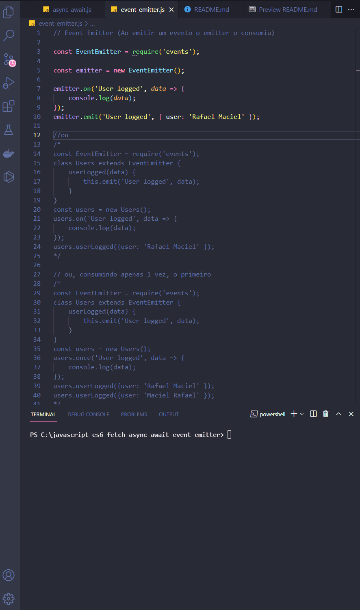

<h1 align="center">
  
   
  JavaScript ES6 - Advanced ES6 2/2
</h1>

<h3 align="justify">
Didactic demonstration of advanced JavaScripty ES6. Credits for the Digital Innovation One Essential ES6 JavaScript module.
</h3>

 

## 📷 Demonstration

<h4 align="left"> promises </h4>
  
   
<h4 align="left" > fetch </h4>  
  
   
<h4 align="left" > async-await </h4>  
  
   
<h4 align="left"> event emitter </h4>
  
   

 

## 🚀 Technologies

This project was developed with the following technologies:

- JavaScript ES6
- NodeJS

 

## ⚙ Operators
- promises
- fetch
- async-await
- event emitter

 

---

Made with 💜 by Rafael Maciel
